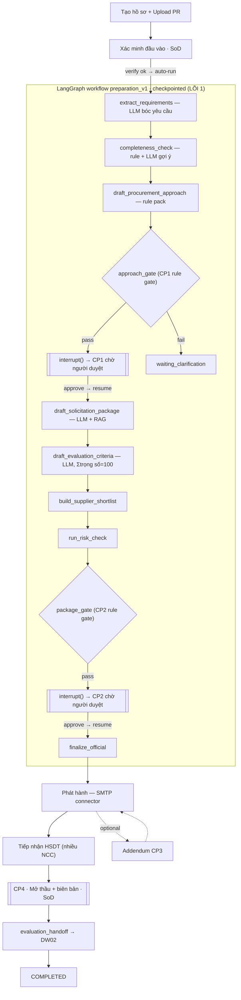

# DW01 — Kiến trúc kỹ thuật lõi & luồng demo

> Tài liệu tập trung vào **3 công nghệ LÕI** trực tiếp giải painpoint và điều khiển luồng
> demo: **(1) LangGraph** (điều phối HITL bền vững), **(2) Tầng AI/LLM** (đọc & soạn có
> kiểm soát), **(3) Rule pack deterministic** (tầng kiểm soát/tin cậy). Hạ tầng còn lại
> (Next, FastAPI, Keycloak, MinIO, SMTP, Qdrant, Postgres) chỉ điểm danh ở cuối.

---

## 1. Painpoint → lời giải công nghệ

Procurement mất 80% thời gian vào việc **đọc tài liệu, kiểm hồ sơ, hỏi đi hỏi lại, copy
template, soạn văn bản, xin ký, theo dõi trạng thái**. DW01 giải bằng:

| Painpoint (việc tay) | Công nghệ LÕI giải nó | Cơ chế |
|---|---|---|
| Đọc PR, bóc yêu cầu | **LLM** (structured extraction) | JSON → **validate Pydantic** |
| Phát hiện thiếu thông tin, hỏi làm rõ | **LLM** (gợi ý câu trả lời) + rule đếm | Con người chỉ xác nhận |
| Soạn HSMT, tiêu chí chấm | **LLM** (drafting) + **RAG** căn cứ pháp lý | Có fallback template/rule |
| Điều phối nhiều bước + **dừng cho người duyệt** | **LangGraph** interrupt + checkpoint | Pause/resume **bền vững** |
| Quyết định hình thức, ngưỡng, gate hợp lệ | **Rule pack** deterministic | Kiểm toán được, không nhờ AI |

**Nguyên tắc:** AI làm phần nặng (đọc/soạn) → **con người quyết định tại CP1–CP4**
(human-in-command A2). AI **không tự trao thầu**.

---

## 2. Sơ đồ luồng tổng quan



Ranh giới quan trọng: **Intake → CP2 chạy TRONG LangGraph** (AI + gate + HITL). **Phát
hành → CP4** là handler giao dịch + connector (ngoài graph).

---

## 3. LÕI 1 — LangGraph: bộ điều phối HITL bền vững

> **Giải painpoint "điều phối nhiều bước + dừng cho người duyệt mà không mất trạng thái".**
> Đây là điểm khác biệt cốt lõi so với một con chatbot chạy 1 mạch.

**Graph là gì:** `preparation_v1` (có version `1.0.0`) — một **StateGraph** gồm các node
tuần tự + **cạnh điều kiện** (conditional edges). State là **TypedDict có kiểu, có version**
(`PreparationState`), truyền qua từng node.

**3 kỹ thuật quan trọng nhất:**

1. **`interrupt(payload)` — dừng cho người (HITL):** tại node `cp1_review`/`cp2_review`,
   graph gọi `interrupt(cp1_payload)`. Graph **tạm dừng ngay tại đó**, không chạy tiếp.
   Khi người duyệt bấm Đồng ý, quyết định được đưa vào và graph **resume đúng chỗ đã dừng**
   (`apply_cp1`). → Con người thực sự "chen vào giữa" máy, không phải AI tự quyết.

2. **SQL checkpointer — pause/resume BỀN VỮNG:** mỗi bước graph **lưu snapshot state vào
   PostgreSQL**. Nhờ vậy quy trình có thể **dừng vài giờ/ngày** chờ CP1, thậm chí **tiến
   trình API khởi động lại** vẫn resume được — không mất state. (Chatbot thường mất ngữ
   cảnh khi tắt.)

3. **Conditional routing — rẽ nhánh theo kết quả gate:**
   `approach_gate → {cp1_review | close_incomplete}`, `apply_cp1 → {draft_solicitation |
   close_failed}`, `apply_cp2 → {finalize_official | close_failed}`. Logic rẽ nhánh **nằm
   trong graph**, tách khỏi UI/DB.

**Quy tắc kiến trúc trong node:** node **không** chứa SQL/HTTP/LLM SDK trực tiếp — chúng
gọi qua **ports** (model gateway, uow, storage, knowledge). Nhờ đó test được và thay
adapter được.

**Vì sao production-ready:** durable checkpoint + interrupt = quy trình dài, nhiều người,
nhiều lần dừng vẫn an toàn; graph có version để nâng cấp mà không phá case đang chạy.

---

## 4. LÕI 2 — Tầng AI/LLM: đọc & soạn có kiểm soát

> **Giải painpoint "đọc tài liệu + soạn văn bản".** Điểm mấu chốt: **AI mạnh nhưng KHÔNG
> được tin mù** — mọi output đều đi qua "van an toàn".

**Kiến trúc gọi model (Ports & Strategy):**
`node → model_gateway.generate_structured(ModelRequest, Schema, run_context)`.
- `RoutingModelGateway` chọn adapter theo **profile** (`configs/models/deepseek.yaml`):
  task `structured_extraction` & `reasoning` → **DeepSeek** (`openai_compatible`).
- Đổi LLM (DeepSeek ↔ OpenAI ↔ local) = **đổi profile YAML**, node không đổi 1 dòng.

**3 van an toàn khiến AI không phá luồng:**

1. **Structured Output → validate Pydantic:** LLM buộc trả **JSON đúng schema**
   (`PreparationExtraction`, `SolicitationDraft`, `CriteriaDraft`). API **parse & validate**;
   sai kiểu thì coi như lỗi. → Không bao giờ nhận "văn xuôi tự do" vào hệ thống.

2. **Fallback deterministic:** LLM lỗi/không cấu hình/kết quả không hợp lệ → **tự dùng rule
   pack/template**. Ví dụ tiêu chí: nếu **tổng trọng số ≠ 100** (`weights_valid()`), bỏ kết
   quả AI, dùng rule pack. → Luồng **không bao giờ vỡ vì AI**.

3. **Prompt có version + siết chặt để chống "bịa":** prompt là **YAML có version**
   (`extract_requirements@1.0.0`…). Prompt bóc yêu cầu được **ràng buộc**: chỉ gắn "điểm
   chưa rõ" cho **đúng 4 hạng mục thương mại còn thiếu**, **cấm tự nghĩ câu hỏi** về
   hãng/model/GPU; PR đủ thì trả **rỗng** → nhờ vậy file đầy đủ **chạy thẳng tới CP1**,
   không hỏi thừa.

**AI được dùng ở đúng 3 chỗ (đều có nhãn xanh trên UI):**

| Node | AI làm gì | Van an toàn |
|---|---|---|
| `extract_requirements` | Bóc REQ-xx + phát hiện điểm chưa rõ + **gợi ý câu trả lời** | schema + rule fallback |
| `draft_solicitation_package` | Soạn phạm vi + yêu cầu kỹ thuật HSMT | schema + template fallback + **RAG citations** |
| `draft_evaluation_criteria` | Đề xuất **tiêu chí có trọng số** | **validate Σ=100** hoặc rule pack |

**RAG (căn cứ pháp lý):** khi soạn HSMT/tiêu chí, gateway tri thức truy hồi văn bản
pháp lý/quy chế từ **Qdrant** (đã **lọc theo tenant/workspace/ACL**) và **gắn trích dẫn**
vào artifact → HSMT có "grounding", không nói khơi khơi.

**Chống hallucination có chủ đích:** AI **được phép** đề xuất *gợi ý* (draft) cho điểm
chưa rõ, nhưng **đánh dấu là gợi ý** để người xác nhận — không tự "bịa" thành dữ kiện chính
thức.

---

## 5. LÕI 3 — Rule pack deterministic: tầng kiểm soát/tin cậy

> Không phải cái gì cũng nên để AI. Những quyết định **phải kiểm toán được** thì dùng
> **rule pack có version** (`configs/policies/dw01/procurement_rules_v1.yaml`).

Trực tiếp điều khiển luồng:

- **Chọn hình thức mua sắm** theo giá trị: ≤100tr → chỉ định (1 NCC); ≤1 tỷ → RFQ (3 NCC);
  >1 tỷ → đấu thầu rộng rãi (3 NCC). → quyết định **rẽ nhánh & ràng buộc số NCC**.
- **Gate CP1 (`approach_gate`)** và **Gate CP2 (`solicitation_gate`)**: kiểm PR đã duyệt,
  ngân sách, deadline, owner, **đủ NCC tối thiểu**, tiêu chí bắt buộc, **tổng trọng số = 100**,
  đủ mục HSMT. **Fail → lưu lý do → UI hiện Alert đỏ** (không dead-end im lặng).
- **Tiêu chí bắt buộc (pass/fail)** luôn từ rule pack (không để AI chế).

→ AI lo "sáng tạo nội dung", rule pack lo "luật & cổng kiểm soát" — tách bạch, tin cậy được.

---

## 6. Luồng từng bước — AI/Graph làm gì · IN → OUT

> **IN** đầu vào · **OUT** artifact · **→NEXT** output thành input bước sau.

| # | Bước (Actor) | AI / Graph / Rule làm gì | IN → OUT → NEXT |
|---|---|---|---|
| 0 | Tạo hồ sơ (Nhân viên) | — (validate form: số tiền, ≥ NCC tối thiểu) | PR file → `case(draft)`, `supplier_input` → khâu xác minh |
| 1 | Xác minh đầu vào (Quản lý · **SoD**) | — → **auto-trigger graph** dưới danh nghĩa người tạo | `case(draft)` → `intake_verification` → khởi động **LangGraph** |
| 2 | Chuẩn hoá nhu cầu | **LLM bóc yêu cầu** (validate Pydantic, idempotent) | PR text → `demand_snapshot(requirements, unknowns)` → completeness |
| 3 | Kiểm đầy đủ & Làm rõ | **rule đếm** + **LLM gợi ý** câu trả lời | `unknowns` → `clarification_list/response` → đủ thì đi thẳng CP1 |
| 4 | Phương án + Gate CP1 | **rule pack** chọn hình thức + `approach_gate` | requirements → `procurement_approach(+gate)` → `interrupt` CP1 |
| 5 | **CP1 duyệt** (Quản lý) | **Graph resume** từ checkpoint | approval → `cp1_approved` → nhánh soạn hồ sơ |
| 6 | Xây hồ sơ | **LLM+RAG** soạn HSMT · **LLM** tiêu chí (Σ=100) · shortlist · risk · `package_gate` | requirements → `solicitation_package`, `evaluation_criteria`, `supplier_shortlist` → `interrupt` CP2 |
| 7 | **CP2 duyệt** (Quản lý) | **Graph resume** → `finalize_official` (khoá bộ hồ sơ) | approval → `official_package` → phát hành |
| 8 | Phát hành | **SMTP connector** gửi RFQ + tự ghi nhận | official → `publication_record` → nhận thầu |
| 9 | (tùy chọn) Addendum CP3 (**SoD**) | handler + quyết định → quay lại `published` | `addendum_draft/decision` → vòng lại |
| 10 | Tiếp nhận HSDT | handler **append** nhiều NCC | HSDT → `submission_register` → CP4 |
| 11 | **CP4 mở thầu** (Quản lý · **SoD**) | handler sinh gói bàn giao | biên bản + sổ → `evaluation_handoff` → **DW02** |

---

## 7. Chuỗi Input → Output rút gọn (để vẽ mũi tên diagram)

```
PR file ─▶ [LLM Extract] ─▶ demand_snapshot(requirements, unknowns)
unknowns ─▶ [Rule + LLM gợi ý] ─▶ clarification (đủ?) ─▶ requirements chốt
requirements ─▶ [Rule pack] ─▶ procurement_approach ─▶ ⟦interrupt CP1⟧
⟦CP1 approve⟧ ─▶ [LLM + RAG] ─▶ solicitation_package
requirements ─▶ [LLM, Σ=100] ─▶ evaluation_criteria
supplier_input ─▶ shortlist + risk ─▶ ⟦interrupt CP2⟧
⟦CP2 approve⟧ ─▶ [finalize] ─▶ official_package (khoá)
official_package ─▶ [SMTP] ─▶ publication_record
HSDT ─▶ submission_register + evaluation_criteria ─▶ ⟦CP4⟧ ─▶ evaluation_handoff ─▶ DW02
```

Mỗi mũi tơ = **output artifact của bước trước là input bước sau**; ⟦…⟧ = **điểm dừng
HITL** do LangGraph `interrupt` tạo ra.

---

## 8. Hạ tầng hỗ trợ (điểm danh — không phải trọng tâm slide)

- **Next.js** — UI role-aware (polling 5s cho demo 2 tab).
- **FastAPI** — REST + composition root (nơi ráp ports↔adapters).
- **Keycloak (OIDC)** — 3 vai Nhân viên < Quản lý < Quản trị, token 8h.
- **PostgreSQL** — system of record: case, artifact, approval, audit, **checkpoint graph** (đa tenant + RLS).
- **MinIO/S3** — lưu file (PR, HSDT, biên bản, gói handoff).
- **Qdrant** — vector store cho RAG (đã lọc tenant ở gateway).
- **SMTP/Slack, Redis + worker** — connector phát hành email & thông báo, việc async.

---

## 9. Tích hợp & khả năng mở rộng (đúng câu sếp hỏi)

- **Tích hợp production:** đổi adapter sau port — email SMTP → **API cổng đấu thầu quốc gia**;
  PR nhập tay → **ERP/webhook**. **Graph & tầng AI không đổi.**
- **Scale:** API **stateless** → scale ngang; **state & checkpoint ở Postgres** nên không
  dính vào 1 instance; việc nặng (LLM/embedding/email) đẩy sang **worker** qua Redis.
- **Đổi LLM:** đổi profile YAML (`RoutingModelGateway`), node không đổi.
- **Kiểm toán/nâng cấp:** graph/prompt/rule pack đều **có version (SemVer)**; artifact có
  version; mọi hành vi ghi audit.

---

*Nguồn: `packages/python/dw_tender/{domain,application,workflows,adapters,presentation}`,
`configs/prompts`, `configs/policies/dw01`, `configs/models`.*
