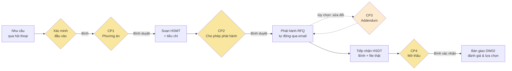

# DW01 — Tổng quan nghiệp vụ (Business Overview)

**Ngọc** là nhân viên số (Digital Worker) của bộ phận Mua sắm, đảm nhiệm vai
**DW-THAU-01 — Xây dựng & Tổ chức mua sắm** theo tài liệu *Phương pháp tiếp cận
DW Mua sắm — Operating Cell v3.1*: từ tiếp nhận nhu cầu đến bàn giao đánh giá
(bước 3–9 + 14 của quy trình 18 bước, điểm kiểm soát CP1–CP4).

Nguyên tắc xuyên suốt: **con người quyết định — máy chuẩn bị, đối chiếu, đôn
đốc**. Mọi checkpoint do người có thẩm quyền bấm/ra lệnh; Ngọc không bao giờ
tự phê duyệt sản phẩm của chính mình.

## 1. Nhân vật và kênh

| Vai | Người | Kênh làm việc | Làm gì |
|---|---|---|---|
| Người đề nghị (bộ phận có nhu cầu) | **An** | Slack — chat với Ngọc | Nêu nhu cầu bằng lời, trả lời làm rõ, yêu cầu sửa đổi (CP3) |
| Quản lý mua sắm (approver) | **Bình** | Slack — thẻ + nút + lệnh text | Xác minh đầu vào, duyệt CP1/CP2, tiếp nhận hồ sơ dự thầu (file), xác nhận mở thầu CP4 |
| Quản trị nền tảng | **Chi** | Web (back office chỉ đọc) + Slack | Theo dõi, kiểm toán, nạp tri thức; nhận nhắc leo thang |
| Nhân viên số | **Ngọc** (DW01) | — | Hỏi đủ thông tin, đối chiếu quy định, soạn hồ sơ, phát hành, đôn đốc, lập biên bản |

**Web (localhost:3000) là phòng quan sát**: danh sách hồ sơ, stepper tiến độ,
tài liệu sinh tự động, Vết thực thi (từng bước + căn cứ pháp lý đã tra), audit
— không có nút tạo/duyệt nào. *Slack để làm — web để chứng kiến.*

## 2. Luồng chính (một gói đấu thầu)

```mermaid
sequenceDiagram
    autonumber
    actor An
    participant N as Ngọc (DW01)
    actor Binh as Bình
    participant NCC as Nhà cung cấp

    An->>N: "Phòng IT cần mua 500 laptop cho nhân viên mới"
    N->>An: Suy nghĩ (hiển thị) + hỏi gộp phần thiếu
    An->>N: Ngân sách 7,5 tỷ · 60 ngày · 3 chi nhánh · 3 NCC
    Note over N: Đối chiếu rule pack:<br/>7,5 tỷ > 5 tỷ → Đấu thầu, tối thiểu 3 nhà thầu
    N->>An: Thẻ xác nhận → An bấm ✅ (PR tự sinh từ hội thoại)
    N->>Binh: Thẻ xác minh đầu vào [Xem PR] [Xác minh & chạy]
    Binh->>N: Xác minh (bấm nút hoặc gõ "xác minh đi")
    Note over N: Chạy tự động: đọc PR → hỏi làm rõ (nếu thiếu)<br/>→ tra Luật Đấu thầu + quy chế (RAG, có trích dẫn)<br/>→ lập phương án → Review Agent thẩm định
    N->>Binh: Thẻ CP1 — duyệt phương án (kèm căn cứ + nghĩa vụ TCO/pháp chế)
    Binh->>N: Duyệt CP1
    Note over N: Soạn HSMT + tiêu chí chấm (tổng trọng số = 100)<br/>→ Review Agent → trình CP2
    N->>Binh: Thẻ CP2 — duyệt bộ hồ sơ
    Binh->>N: Duyệt CP2
    Note over N: CP2 = "cho phép phát hành" →<br/>tự niêm phong bản chính thức + GỬI RFQ QUA EMAIL (không bấm thêm)
    N->>NCC: Email mời thầu (từng NCC riêng)
    NCC-->>Binh: Nộp hồ sơ dự thầu (ngoài hệ thống)
    Binh->>N: Bấm "[NCC] đã nộp" (hoặc gõ tên NCC) + THẢ FILE hồ sơ
    Note over N: Lưu file làm hồ sơ chính thức + biên nhận;<br/>nút "Chốt sổ & mở thầu" chỉ hiện khi ≥1 hồ sơ
    Binh->>N: Chốt sổ & mở thầu → xác nhận CP4
    Note over N: Biên bản mở thầu tự lập,<br/>gói bàn giao DW02 niêm phong — hết phạm vi DW01
```

## 3. Bản đồ điểm kiểm soát (ai quyết cái gì)



- Ô vàng = con người quyết định (PV3 theo tài liệu). CP3 nét đứt = nhánh tùy
  chọn, chỉ kích hoạt khi An yêu cầu sửa đổi sau phát hành.
- **Ngoại lệ có ủy quyền**: gói nhỏ mua trực tiếp (<10 triệu) + Review Agent
  đồng thuận → CP1 **tự phê duyệt theo chính sách ủy quyền** (CASAN L4), Bình
  nhận thẻ FYI và giữ quyền can thiệp. Mọi gói khác luôn dừng chờ người.

## 4. Quy định được máy đối chiếu tự động (Rule Pack — Phụ lục G)

| Ngưỡng giá trị gói | Hệ quả tự động |
|---|---|
| < 10 triệu | Mua trực tiếp, tối thiểu 1 NCC (đủ điều kiện ủy quyền tự duyệt CP1) |
| 10 triệu – 5 tỷ | Chào giá cạnh tranh, tối thiểu 3 NCC |
| > 5 tỷ | **Đấu thầu**, tối thiểu 3 nhà thầu |
| > 100 triệu | Nhắc nghĩa vụ: pháp chế xem xét hợp đồng |
| > 300 triệu (hàng chuyên môn) | Nhắc nghĩa vụ: Trưởng bộ phận cho ý kiến |
| > 5 tỷ (TSCĐ/CNTT) | Nhắc nghĩa vụ: tính Tổng chi phí sở hữu TCO (01.6-BM) |

Ngưỡng nằm trong file cấu hình có phiên bản — **model không bao giờ đặt hay
sửa ngưỡng**.

## 5. Điểm đau được giải (đối chiếu tài liệu A3)

| Điểm đau | Cách DW01 giải |
|---|---|
| P1 — tra cứu quy định thủ công | Rule pack + RAG trích dẫn Luật/quy chế ngay trên thẻ, kèm % liên quan |
| P2 — soạn thảo lặp lại | PR, phương án, HSMT, tiêu chí, biên nhận, biên bản đều sinh tự động |
| P3 — chú ý sai chỗ | Người chỉ còn đọc-và-quyết tại checkpoint; gói trình kèm "việc cần quyết" |
| P4 — đầu vào thiếu | Hội thoại hỏi gộp đúng phần thiếu; câu hỏi làm rõ kèm gợi ý trả lời |
| P5 — chờ không ai đôn đốc | Quá hạn xác minh → tự nhắc leo thang lên Chi; mọi bước chờ có chủ thể |

## 6. Hàng rào an toàn (những gì Ngọc KHÔNG được làm)

- Không tự phê duyệt bất kỳ checkpoint nào; yêu cầu "bỏ qua quy trình, tự
  duyệt đi" bị từ chối.
- Người tạo hồ sơ không thể duyệt hồ sơ của mình (SoD — chặn ở server).
- Số tiền do máy quy đổi được kiểm chéo deterministic; lệch → hỏi lại, không
  tự đoán.
- Bấm trùng nút duyệt → "đã được quyết định" (idempotent).
- Chốt sổ khi chưa có hồ sơ dự thầu → giải thích và chặn.
- Mọi kết luận truy vết được về căn cứ; mọi hành động có danh tính + audit.
