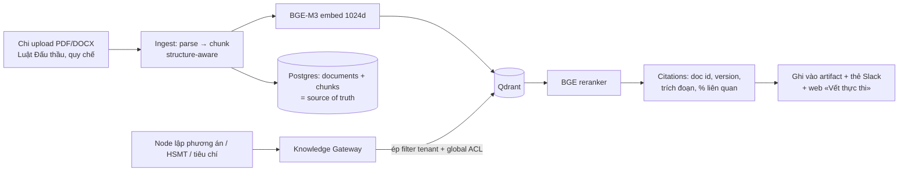

# DW01 — Tổng quan kỹ thuật (Technical Overview)

Mức độ: đủ để vẽ diagram và hiểu ranh giới thành phần — chi tiết sâu xem
`docs/architecture/` và code từng package.

## 1. Bức tranh thành phần

```mermaid
flowchart TB
    subgraph Slack["Slack (front office)"]
        DM_An[DM An — chat intake]
        DM_Binh[DM Bình — thẻ duyệt, nhận file, lệnh text]
        DM_Chi[DM Chi — nhắc leo thang]
    end

    subgraph API["apps/api (FastAPI, modular monolith)"]
        SOCK[Slack Socket Mode adapter<br/>identity: Slack ID → subject → membership DB]
        CONV[ConversationIntakeService<br/>slot-based memory, channel-agnostic]
        HAND[Application handlers<br/>create/verify/decide/publish/submission/CP4]
        GRAPH[LangGraph preparation_v1<br/>extract → clarify → approach → CP1 →<br/>build → CP2 → finalize]
        RULES[Rule pack v1 (YAML, Phụ lục G)<br/>deterministic gates]
        RAGG[Knowledge Gateway<br/>tenant/ACL filter ép phía server]
    end

    subgraph Worker["apps/worker"]
        OUTB[Notification consumer<br/>outbox → Block Kit → DM]
        INGEST[Knowledge ingest pipeline]
    end

    subgraph Data["Hạ tầng dữ liệu"]
        PG[(PostgreSQL + RLS<br/>cases, artifacts, chats,<br/>approvals, outbox, checkpoints)]
        QD[(Qdrant 1024d<br/>BGE-M3 vectors)]
        MINIO[(MinIO/S3<br/>PR, HSMT, HSDT files)]
        VK[(Valkey — cache, không phải source of truth)]
    end

    subgraph Ext["Bên ngoài"]
        LLM[DeepSeek<br/>chat + reasoner]
        TEI[TEI self-host<br/>BGE-M3 embed + rerank]
        SMTP[Gmail SMTP<br/>phát hành RFQ]
        KC[Keycloak OIDC<br/>web login]
    end

    WEB[apps/web — Next.js<br/>back office CHỈ ĐỌC, poll 5s<br/>Vết thực thi + citations]

    DM_An <--> SOCK
    DM_Binh <--> SOCK
    SOCK --> CONV
    SOCK --> HAND
    CONV --> HAND
    HAND --> GRAPH
    GRAPH --> RULES
    GRAPH --> RAGG
    CONV --> LLM
    GRAPH --> LLM
    RAGG --> QD
    RAGG --> TEI
    HAND --> PG
    GRAPH --> PG
    HAND --> MINIO
    HAND --> SMTP
    PG --> OUTB
    OUTB --> DM_An
    OUTB --> DM_Binh
    OUTB --> DM_Chi
    WEB --> API
    WEB --> KC
    INGEST --> QD
```

Ranh giới hexagonal: domain/application không import FastAPI, SQLAlchemy,
LangGraph hay SDK provider — mọi hệ ngoài đứng sau port/adapter; composition
root (`bootstrap.py`) là nơi duy nhất nối adapter thật.

## 2. Một tin nhắn đi qua hệ thống như thế nào

```mermaid
sequenceDiagram
    autonumber
    participant S as Slack
    participant AD as Socket adapter (api)
    participant CS as ConversationIntakeService
    participant L as DeepSeek
    participant DB as Postgres (RLS)
    participant G as LangGraph run
    participant W as Worker (outbox consumer)

    S->>AD: message event (dedupe theo event_id)
    AD->>AD: Slack ID → subject → AccessContext (membership DB)
    AD->>S: placeholder "Đang suy nghĩ…"
    AD->>CS: handle_message(channel_key, text, context)
    CS->>DB: load slots của hội thoại (KHÔNG đọc scrollback)
    CS->>L: structured output: intent + slots mới
    CS->>CS: money guard + missing_required (rule pack)
    CS->>DB: lưu slots; đủ thì tạo case + PR sinh từ hội thoại
    CS-->>AD: thinking (system-built) + replies
    AD->>S: cập nhật placeholder + gửi trả lời
    Note over DB,W: Mọi card thông báo = outbox row<br/>ghi CÙNG transaction với nghiệp vụ
    W->>DB: poll outbox (idempotency key)
    W->>S: render Block Kit → DM đúng người nhận
    Note over G: Duyệt CP → resume run từ checkpoint bền<br/>(pause/resume qua interrupt + Postgres checkpointer)
```

Điểm nhấn thiết kế:

- **Trí nhớ chat = slot state trong DB**, không phải transcript — miễn nhiễm
  loãng context, xóa được, RLS theo tenant.
- **LLM drafts; deterministic code decides**: model chỉ bóc thông tin và soạn
  câu; ngưỡng/hình thức/số NCC/gate do rule pack + code quyết. Kiểm chéo số
  tiền, action routing, match tên NCC đều deterministic.
- **Outbox pattern**: thông báo Slack không bao giờ "bắn rồi quên" — hàng đợi
  trong cùng transaction, worker gửi với idempotency, retry, đánh dấu failed.
- **Approval pause/resume**: CP1/CP2 dừng graph bằng interrupt; quyết định
  (nút hoặc text) resume từ checkpoint bền trong Postgres.

## 3. RAG (tra cứu luật/quy chế)



- Filter tenant/ACL chỉ được inject **bên trong gateway** — node không bao giờ
  tự dựng filter.
- Vector là dữ liệu dẫn xuất: mất/sai chiều → rebuild từ chunks Postgres
  (`scripts/knowledge_reindex.py`).
- Không truy được căn cứ → artifact đánh dấu `not_available` + cảnh báo người
  duyệt phải đối chiếu tay (không bịa trích dẫn).

## 4. Bảo mật & kiểm soát

| Lớp              | Cơ chế                                                                                                                     |
| ---------------- | -------------------------------------------------------------------------------------------------------------------------- |
| Danh tính chat   | Slack member ID → subject (env/config map) → membership DB → AccessContext; chat không bao giờ là authorization            |
| Phân quyền       | Scope-based ở application handler; UI ẩn nút chỉ là mỹ thuật, server chặn thật (403)                                       |
| SoD              | Người tạo case không thể duyệt checkpoint của chính mình — chặn ở ApprovalFlow                                             |
| Tenant isolation | Postgres RLS ép theo `app.tenant_id` mỗi transaction; Qdrant filter ép trong gateway; object key MinIO có tenant/workspace |
| Idempotency      | Slack event dedupe (DB), outbox idempotency key, artifact content-hash, double-click an toàn                               |
| Audit            | Mọi hành động có identity + timestamp; artifact/prompt/rule pack đều có version                                            |
| Secrets          | `.env` (gitignored); realm Keycloak JSON chỉ là seed demo, credential thật nằm trong Postgres/vault                        |

## 5. Bản đồ mã nguồn (rút gọn)

| Đường dẫn                                                            | Vai trò                                                         |
| -------------------------------------------------------------------- | --------------------------------------------------------------- |
| `apps/api/src/dw_api/channels/slack.py`                              | Socket adapter: event/interactive, receipt desk, text decisions |
| `apps/api/src/dw_api/bootstrap.py`                                   | Composition root — nối mọi adapter                              |
| `packages/python/dw_tender/.../conversation/`                        | Chat intake service + schemas (slot, money guard)               |
| `packages/python/dw_tender/.../preparation/`                         | Handlers, rules (gates), review agent                           |
| `packages/python/dw_tender/.../workflows/preparation_v1/`            | LangGraph nodes CP1→CP4                                         |
| `packages/python/dw_connectors/`                                     | Slack chat/notifier/signature, SMTP, mock connectors            |
| `packages/python/dw_knowledge/`                                      | Gateway RAG, ingest, Qdrant/TEI adapters                        |
| `configs/policies/dw01/procurement_rules_v1.yaml`                    | Rule pack (Phụ lục G)                                           |
| `configs/prompts/**`                                                 | Prompt có version (intake 1.3.0, clarify, review)               |
| `apps/web/app/procurement/dw01/`                                     | Back office chỉ đọc + Vết thực thi                              |
| `scripts/demo_reset.sh`, `slack_clear_dm.py`, `knowledge_reindex.py` | Vận hành demo                                                   |
